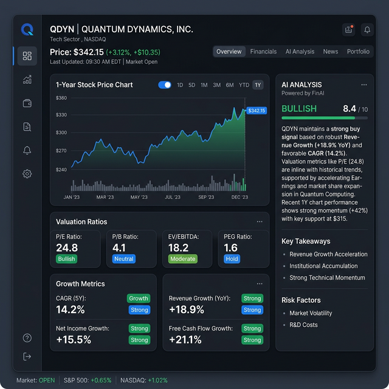
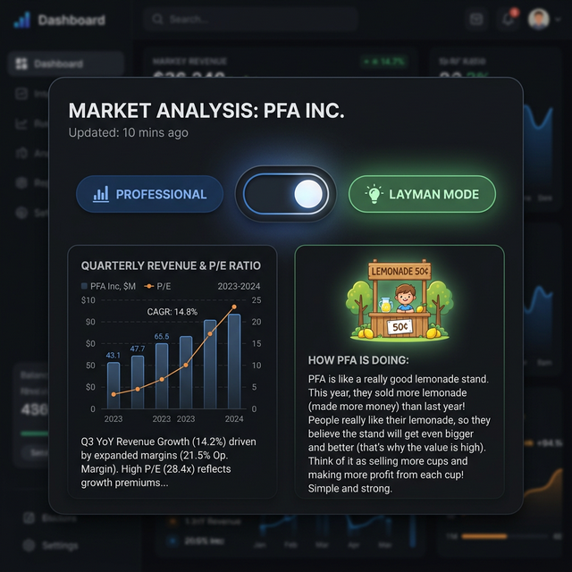
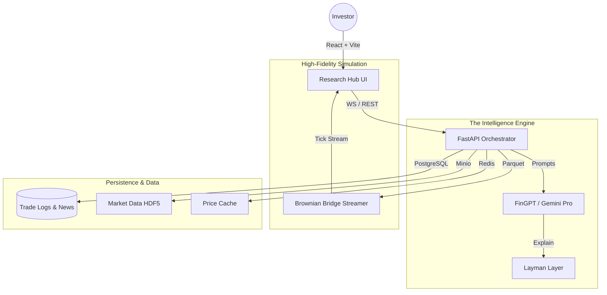

# 🚀 Tradeshift Engine: The Future of AI-Driven Equity Research

[](https://opensource.org/licenses/MIT)
[](https://github.com/FinNLP/FinGPT)
[](https://www.docker.com/)

**Tradeshift Engine** is an institutional-grade, open-source stock research and simulation ecosystem. It bridges the gap between raw financial data and high-conviction investment theses, democratizing the tools used by top hedge funds for retail investors and fintech founders.

---

## 💡 The Vision: "Democratizing Institutional Clarity"

Most retail investors fail due to the **"Information-Insight Gap"**. They have data (Screener.in), but lack the *reasoning* (The Thesis). Tradeshift solves this by applying state-of-the-art LLMs (**FinGPT**) to raw fundamental data, creating a platform that not only shows you the numbers but *explains* the business quality.

---

## 💎 Core Products

### 1. 🔍 The Research Hub (The "Screener" Killer)
A comprehensive dashboard that visualizes the heartbeat of any business. 
- **5-Year Growth Analysis**: Visualize Revenue vs. Profit vs. Margins to detect "Window Dressing."
- **Institutional Ratios**: Real-time tracking of ROCE, Debt/Equity, and PEG ratios.
- **CAGR Velocity**: Understand long-term compounding with intuitive growth charts.



### 2. 🧠 FinGPT "AI Analyst" & Layman Mode
Our proprietary AI pipeline transforms complex financial statements into high-conviction reports.
- **Deep Thesis**: Institutional-grade SWOT, MOAT, and Capital Allocation analysis.
- **Layman Mode Toggle**: One-click cognitive load reduction. Explains "Non-Current Liabilities" as "Long-Term Store Credit" via intuitive analogies.



### ⏱️ News Replay & Impact Quantifier
Replay specific market dates to see exactly how news flashes affected price action within a 15-minute window. Compare **AI-predicted sentiment** vs. **Actual market reaction** to identify "News Alpha" strategies.

---

## 🏗️ Technical Architecture

Tradeshift is built on a high-concurrency, microservices-first stack designed for 99.9% uptime and sub-second data streaming.



---

## 🚀 Getting Started

### 1. Prerequisites
- Docker & Docker Compose
- API Keys: `GEMINI_API_KEY`, `NEWSDATA_API_KEY`, `HUGGINGFACE_API_KEY`

### 2. Fast Deployment
```bash
git clone https://github.com/Ritsham/tradeshift-engine.git
cd tradeshift-engine

# Configure Environment
cp backend/.env.example backend/.env 

# Spin up the Ecosystem
docker-compose up --build
```

### 3. Native Endpoints
- **Frontend Hub**: `http://localhost:5173`
- **AI API Docs**: `http://localhost:8000/docs`

---

## 🛠️ The Startup Roadmap

| Phase | Status | Focus |
| :--- | :--- | :--- |
| **Phase 1** | ✅ | **Core Engine**: News Replay & Tick Simulation. |
| **Phase 2** | ✅ | **Research Hub**: Fundamentals & AI Layman Mode. |
| **Phase 3** | ⏳ | **Strategy Studio**: No-code Backtesting & Alerts. |
| **Phase 4** | 🚀 | **Marketplace**: B2B Research-as-a-Service APIs. |

---

## ⚡ Tech Stack Deep-Dive

### Backend
- **Framework**: FastAPI (Asynchronous Orchestration)
- **Database**: PostgreSQL (TimescaleDB for time-series optimization)
- **Messaging**: RabbitMQ (Async news processing)
- **Analytics**: Pandas/NumPy (Parquet data processing)
- **Caching**: Redis (Sub-second tick caching)

### Frontend
- **Framework**: React 18 (TypeScript)
- **Charts**: Recharts & TradingView Lightweight Charts
- **Styling**: Tailwind CSS (Premium Dark Theme)
- **Icons**: Lucide React

---

## 🤝 Community & Contribution

Tradeshift is built for the community, by the community. 
- **Founders**: Fork this repo to build your own fintech landing page or research app.
- **Devs**: Pull requests for new ratios, better LLM prompts, or UI enhancements are always welcome.

---

## 📄 License

Distributed under the MIT License. **Go build something great.**

---
**Crafted for Alpha seekers and Fintech visionaries.**